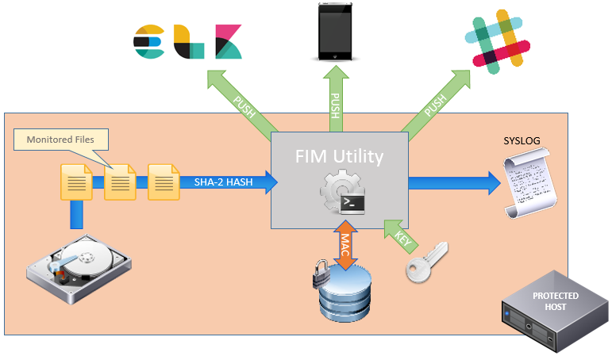

# Monthly Journal 1

### The Idea
After toying with a few initial ideas, I talked to our in house security team because I wanted to a real world security related problem for my project. After a quick chat, a good idea came about. A file integrity monitoring solution, or FIM. I had to do a little research. Turns out, there are many tools already that do something similar. Tripwire, Aide, Samhain to name a few. Almost all qre built in C derivatives for obvious performance reasons. My plan is to write an application which addresses the specific uses cases and requirements and develop with a modern programing language and using existing PAAS, libraries and services as much as possible.


### RWE

The treat of ransom-ware is very much to the forefront of Watson Platform for Health security concerns. Patient Health Information (PHI) is highly valued by cyber criminals and our in-house Ops and Security team are engaged in a continuous cycle of security evaluation and improvement. The threat of malware inside the firewall is almost of grave concern and the potential for PHI loss if very real. We recognised the need for an IDS solution that can detect malware and Trojans and also detect and prevent a ransom-ware attack e.g. [CryptoLocker](#1-httpsenwikipediaorgwikicryptolocker) [1] which typically involves encryption of victim's files.


### Getting Started

Trying to get started has been difficult due to work commitments.


### Design & Requirements

My design centres on a client-server architecture using a master and slave approach. Any number of Slaves can be deployed on a server to monitor files and send back integrity information to the master which Compares integrity information with that stored in a secure database to ensure the integrity of monitored files.




### Python

I have decided to use Python to develop my solution due to the flexibility of the language and the speed at which results can be achieved. Python also offers a huge array of community supported libraries and functions that I hope to be able to take advantage of. Python also has numerous web frameworks. I am going to utilise the Flask framework for my application using a micro-services approach. Flask is also supported by Bluemix which is where I plan to host my Python application. I have very little practical experience with Python.


### HMAC


### Authentication


### Slack


### SSL


### Bluemix

Bluemix is a great platform for learning new technologies. It supports Flask web frameworks and has a number of different data storage solutions. I chose Cloudant because I want to get more hands on with NoSQL and I already have a lot of experience with DB2.


### Containers

Spent most of the time this week trying to containerise the application. I'm heavily invested in DevOps in my day job so I've played a bit Docker and regularly attend meetups. Before the app can be deploy on the Watson platform, it will need to run in a container. Time spent getting everything working could probably have been spent on other features but once I start on something, I can't leave it alone.

`$ docker build -t alanoneill/fimpy:latest . `

```docker
FROM ubuntu:zesty
MAINTAINER "alan.oneill75@gmail.com"
RUN apt-get update -y
RUN apt-get install -y python-pip python-dev build-essential libldap2-dev libsasl2-dev libssl-dev
COPY . /app
WORKDIR /app
RUN pip install -r requirements.txt
EXPOSE 5000
ENV SLACKTOKEN=
#ENTRYPOINT ["python"]
#CMD ["app.py"]
CMD ["python","-u","app.py"]
```


### Kubernetes

I've become obsessed with Kubernetes lately. I first became aware of it watching a Google Dev conference on YouTube a couple of years ago. It really is amazing technology. Bluemix (soon to be known as IBM Cloud) offers a free one node cluster so of course I had to spend time getting the app deployed as a Kube service. In order to get the deployment to work on a Bluemix cluster, I needed to publish my image to [dockerhub](https://hub.docker.com/r/alanoneill/fimpy/).

```yaml
apiVersion: apps/v1beta1
kind: Deployment
metadata:
  name: pyfim-app
  labels:
    app: pyfim-app
spec:
  selector:
    matchLabels:
      app: pyfim-app
  template:
    metadata:
      labels:
        app: pyfim-app
    spec:
      containers:
      - name: pyfim-app
        image: alanoneill/pyfim
        ports:
        - containerPort: 5000
```

```yaml
apiVersion: v1
kind: Service
metadata:
  name: pyfim-service
  labels:
    name: pyfim-app
spec:
  type: NodePort
  ports:
    - port: 5000
      targetPort: 5000
      protocol: TCP
      name: pyfim-service
  selector:
    app: pyfim-app
```


### Testing

#### POST /api/fimpy - Write monitored file info to db
```bash
$ curl -k -X POST -u admin:password --url https://127.0.0.1:5000/api/fimpy
Records added to db
```

#### GET /api/fimpy - Read monitored file info from db
```bash
$ curl -k -u admin:password --url https://127.0.0.1:5000/api/fimpy
[
  "/app/test/11kfile",
  "/app/test/sniff.py",
  "/app/test/jumpcloud_test_utility.sh",
  "/app/test/10kfile"
]
```

#### LDAP Authenication Failure
```bash
$ curl -v -k -u admin:badpw --url https://127.0.0.1:5000/api/fimpy/scan
*   Trying 127.0.0.1...
* TCP_NODELAY set
* Connected to 127.0.0.1 (127.0.0.1) port 5000 (#0)
* ALPN, offering http/1.1
* Cipher selection: ALL:!EXPORT:!EXPORT40:!EXPORT56:!aNULL:!LOW:!RC4:@STRENGTH
* successfully set certificate verify locations:
*   CAfile: /etc/ssl/certs/ca-certificates.crt
  CApath: /etc/ssl/certs
* TLSv1.2 (OUT), TLS header, Certificate Status (22):
* TLSv1.2 (OUT), TLS handshake, Client hello (1):
* TLSv1.2 (IN), TLS handshake, Server hello (2):
* TLSv1.2 (IN), TLS handshake, Certificate (11):
* TLSv1.2 (IN), TLS handshake, Server key exchange (12):
* TLSv1.2 (IN), TLS handshake, Server finished (14):
* TLSv1.2 (OUT), TLS handshake, Client key exchange (16):
* TLSv1.2 (OUT), TLS change cipher, Client hello (1):
* TLSv1.2 (OUT), TLS handshake, Finished (20):
* TLSv1.2 (IN), TLS change cipher, Client hello (1):
* TLSv1.2 (IN), TLS handshake, Finished (20):
* SSL connection using TLSv1.2 / ECDHE-RSA-AES256-GCM-SHA384
* ALPN, server did not agree to a protocol
* Server certificate:
*  subject: C=IE; ST=DUB; L=Dublin; O=IBM; OU=Watson; CN=xubuntu
*  start date: Nov  2 19:44:48 2017 GMT
*  expire date: Nov  2 19:44:48 2018 GMT
*  issuer: C=IE; ST=DUB; L=Dublin; O=IBM; OU=Watson; CN=xubuntu
*  SSL certificate verify result: self signed certificate (18), continuing anyway.
* Server auth using Basic with user 'admin'
> GET /api/fimpy/scan HTTP/1.1
> Host: 127.0.0.1:5000
> Authorization: Basic YWRtaW46YmFkcHc=
> User-Agent: curl/7.52.1
> Accept: */*
>
* HTTP 1.0, assume close after body
< HTTP/1.0 401 UNAUTHORIZED
* Authentication problem. Ignoring this.
< WWW-Authenticate: Basic realm="Login Required"
< Content-Type: text/html; charset=utf-8
< Content-Length: 20
< Server: Werkzeug/0.12.2 Python/2.7.13
< Date: Sun, 05 Nov 2017 19:18:25 GMT
<
* Curl_http_done: called premature == 0
* Closing connection 0
* TLSv1.2 (OUT), TLS alert, Client hello (1):
Authenticaton failed
```

####### [1] https://en.wikipedia.org/wiki/CryptoLocker
