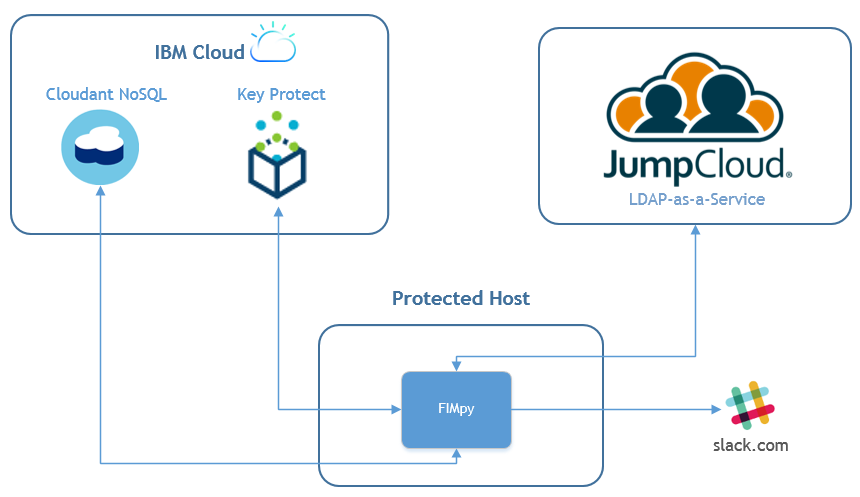

## Design & Requirements

I've called the application FIMpy! Originally I called it pyFIM only to google and find a million unrelated things called pyfim. Oh. And here is FIMpy...!

The initial design from my proposal was for a standalone FIM utility but it doesn't work well in a Cloud environment. I want to take advantage of services and develop a micro-service driven solution. That doesn't make sense if everything is local. What it you want to monitor many different hosts? I need to spend more time thinking about the solution architecture.

**Update:** I'm starting to look at a client-server architecture using a master and slave approach. Any number of slaves deployed on a nodes to monitor files and send back integrity information to the master which verifies integrity by comparing information with that stored in a secure database. That will of course be a lot more work. I need to develop the client first and then look at the server. It needs to be micro-service driven so Flask is perfect. So all communication can be via REST.

New design using services...

NFR will be very important:

* Performance - Python/NoSQL may not be best. [Cython](https://en.wikipedia.org/wiki/Cython) [1] can help with speed. We'll see how Cloudant performs with queries.
* Security - goes without saying. SSL encryption, secure authentication.
* Auditing - will need to be auditable.

[1] [https://en.wikipedia.org/wiki/Cython](https://en.wikipedia.org/wiki/Cython)

