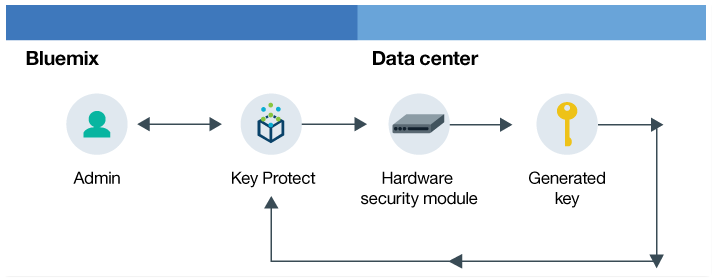

## Bluemix

    

Bluemix is an excellent platform to learning new technologies. I've play with many runtimes and services over the last year. It supports Flask web frameworks and has a number of different data storage solutions. Initially I planned to run a native Python app using Flask but that got superceeded by Docker and then again by Kubernetes.

I have plenty of experience with DB2  so I plan to use [Cloudant](https://console.bluemix.net/docs/services/Cloudant/cloudant.html#overview) [1] instead for a data solution. I want to get more hands on with NoSQL. It also has very good Python support and there is great tutorial [here](https://console.bluemix.net/docs/services/Cloudant/getting-started.html#getting-started-with-cloudant).

I hope to use AppID for authentication but I am very familiar with it and it looks like it might be more of a IDP/SSO type service.

There is also an interesting new service called [Key Protect](https://console.bluemix.net/docs/services/keymgmt/keyprotect_about.html#about-key-protect) [2] that I plan to take a look at. It is a secure key management service which is exactly what I need for generating and validating HMAC's.

**[1]** [https://console.bluemix.net/docs/services/Cloudant/cloudant.html#overview](https://console.bluemix.net/docs/services/Cloudant/cloudant.html#overview)

**[2]** [https://console.bluemix.net/docs/services/keymgmt/keyprotect_about.html#about-key-protect](https://console.bluemix.net/docs/services/keymgmt/keyprotect_about.html#about-key-protect)

