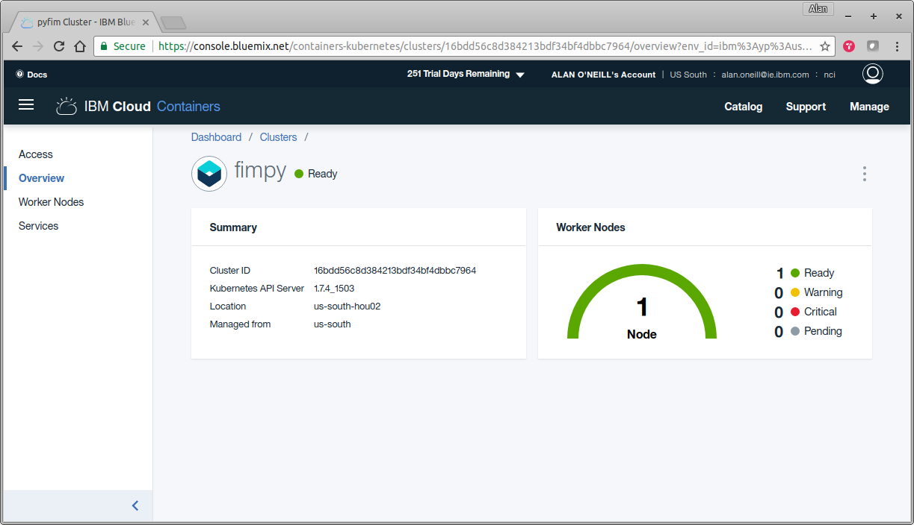
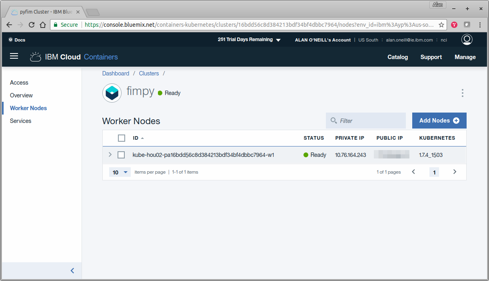

# Kubernetes Reference





### Configure Local kubectl Client

```bash
export KUBECONFIG=/home/oneillal/.bluemix/plugins/container-service/clusters/fimpy/kube-config-hou02-fimpy.yml
```

### Create Service

```bash
~/dev/project/FIMpy(master*) » kubectl create -f kube-service.yaml
service "fimpy-service" created
```

### Create Deployment

```bash
~/dev/project/FIMpy(master*) » kubectl create -f kube-deployment.yaml
deployment "fimpy-app" created
```

### Get Service

```bash
~/dev/project/FIMpy(master*) » kubectl get service -o wide                                                                                                                                                                                                         oneillal@xubuntu
NAME            TYPE        CLUSTER-IP     EXTERNAL-IP   PORT(S)          AGE       SELECTOR
fimpy-service   NodePort    172.21.13.63   <none>        5000:31342/TCP   2m        app=fimpy-app
kubernetes      ClusterIP   172.21.0.1     <none>        443/TCP          10d       <none>
```

### Get Pod

```bash
~/dev/project/FIMpy(master*) » kubectl get pods -o wide
NAME                         READY     STATUS    RESTARTS   AGE       IP              NODE
fimpy-app-3774997280-glctd   1/1       Running   0          2m        172.30.91.215   10.76.164.243
```

### Logs

```bash
~/dev/project/FIMpy(master*) » kubectl logs -f fimpy-app-3774997280-glctd
Found local VCAP_SERVICES
fimpy-app-3774997280-glctd
 * Running on https://0.0.0.0:5000/ (Press CTRL+C to quit)
 * Restarting with stat
 * Debugger is active!
 * Debugger PIN: 184-335-951
```

### Deployment Shell Access

```bash
~/dev/project/FIMpy(master*) » kubectl exec -i -t fimpy-app-3774997280-glctd bash

root@fimpy-app-3774997280-glctd:/app# ps -ef
UID        PID  PPID  C STIME TTY          TIME CMD
root         1     0  0 18:36 ?        00:00:00 /pause
root         5     0  0 18:36 ?        00:00:00 python -u main.py
root        15     5  1 18:36 ?        00:00:15 /usr/bin/python main.py
root        23     0  0 19:00 pts/0    00:00:00 bash
root        32    23  0 19:00 pts/0    00:00:00 ps -ef
```