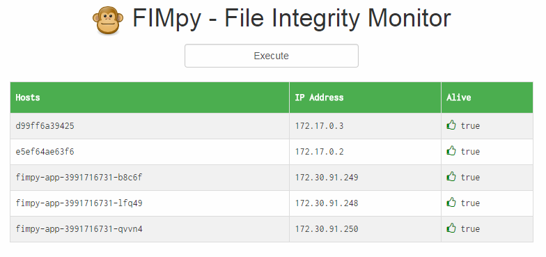

# Time for Some You-Eye

Until now it's been all terminals and VI. Time for a bit of UI. I want to be able to show some real-time monitoring info.

https://stackoverflow.com/questions/13315883/how-to-structure-data-to-easily-build-html-tables-in-flask

https://stackoverflow.com/questions/31965558/how-to-display-a-variable-in-html

https://fonts.google.com/specimen/Inconsolata?selection.family=Inconsolata
